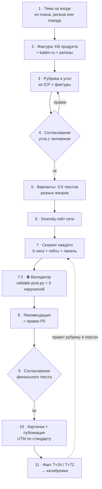

# Runbook: от темы до вышедшего поста

> Операторский порядок работы для канала [@kaiten_ru](https://t.me/kaiten_ru): что за чем
> и где в цикле стоит человек. Методика оценки - [SCORING-METHOD.md](SCORING-METHOD.md),
> движок прогона - [SCORING-PIPELINE.md](SCORING-PIPELINE.md), разнообразие -
> [DIVERSITY.md](DIVERSITY.md). Эталон тона - `references/gold-standard.md`,
> ЦА - `references/icp-kaiten.md`, голос канала - `references/voice-profile.md`.
>
> **Два обязательных согласования с человеком:** (1) угол и фактура до генерации,
> (2) финальный текст до публикации. Без них пост не выходит.

## Поток



## Шаги

### 1 · Тема на входе

Источники тем, по убыванию частоты:

- **очередь плана** - `content/plan.md`, раздел «Очередь»;
- **релиз продукта** - дайджест обновлений, новая фича, изменение тарифа;
- **рыночный повод** - `content/insights.md` (уход сервиса, регуляторка, отраслевая новость);
- **кейс клиента** - готовая история с цифрами;
- **вопрос из комментариев или поддержки** - самый недооценённый источник.

Завести папку `content/posts/<YYYY-MM-DD>-<slug>/`. Внутри: `post.md` (варианты и разбор),
`ab-plan.json` (предсказание и факт), картинки кладутся рядом.

Первым делом прогнать `python scripts/check-facts.py` - если по прошлым постам висят долги
по факту, сначала закрыть их. Новый пост поверх незакрытой петли обесценивает обе.

### 2 · Фактура ⛔ гейт качества

**Два источника, оба обязательны.** Пост, собранный из общих знаний агента, узнаётся
по первому абзацу и повторяет предыдущие.

1. **KB продукта** - вики Кайтена: продуктовые факты и границы модулей (из них же берётся
   разметка утверждений FACT/INF/RISK), обзор компании, кейсы с цифрами, голос бренда,
   уроки прошлых постов. Ни одно продуктовое утверждение не пишется вразрез с фактами KB.
2. **Свежая конкретика** - страницы kaiten.ru под тему: лендинг фичи, статьи блога,
   кейсы клиентов, документация, релизноуты. Вытащить названия клиентов, цифры, дословные
   формулировки болей, реальные названия кнопок и полей интерфейса.

⚠️ **Скриншот интерфейса бьёт описание интерфейса.** Прецедент из инфлюенс-репо: тексты
описывали шаблон документом, а на посадочной это была доска с WIP-лимитами и гейтами.
Если пост обещает конкретный экран, экран надо увидеть.

Источники (файлы KB и URL) перечислить в `post.md`. Утверждение без источника в пост не идёт.

### 3 · Рубрика и угол

- Определить **рубрику** из `docs/CONTENT-PLAN.md` (дайджест, разбор фичи, кейс, методология,
  вопрос-ответ, повод, закулисье). Рубрика диктует семейство жанров и длину.
- Определить задетые **ICP-роли и боли** дословно из `references/icp-kaiten.md`.
- Сформулировать **конкретный угол**, а не «расскажем про фичу»: что человек сможет сделать
  после прочтения и чего не мог до. Дать 1-3 варианта угла с обоснованием.
- Свериться с `content/plan.md`: этот угол уже выходил? Метафора уже использовалась?
  Повтор угла в своём канале заметнее, чем в чужом, потому что аудитория та же самая.

### 4 · Согласование угла ⛔ гейт

Человек выбирает или правит угол. Генерация только после «ок».

### 5 · Варианты: 3-5 текстов разных жанров

- **Разные жанры**, не пять кузовов одной машины: разбор, сценка-диалог, мини-тест,
  непопулярное мнение, FAQ, лекция-методология, новостной повод, «плюсы и хотелки».
  Палитра и профили жанров - [DIVERSITY.md](DIVERSITY.md).
- Конкретика из фактуры шага 2, чистый текст без вклеенных инлайн-стилей.
- Длина под рубрику: дайджест до 700 знаков, разбор фичи 1200-2000, методология до 3000.
  Телеграм показывает в свёрнутом виде и в пуше первые ~90 символов, они решают всё.
- Голос по умолчанию - от бренда, на «вы». Первое лицо только там, где это правда голос
  конкретного человека из команды и это подписано.

### 6 · Diversity-гейт сета

До скоринга: скелет-тест, шафл-тест, тест открытий, тест CTA. Подробности и критерии -
[DIVERSITY.md](DIVERSITY.md). Сет, не прошедший гейт, на скоринг не подаётся.

### 7 · Скоринг каждого варианта

Полный прогон по [SCORING-PIPELINE.md](SCORING-PIPELINE.md): разметка утверждений
FACT/INF/RISK → integrity-гейт → 6 линз с весами → composite и зона → соответствие голосу
канала (гейт ≥70 по `references/voice-profile.md`) → панель персон сегмента с прогнозом
действия → adversarial-проверка HIGH-находок → правки P0/P1 → `ab-plan.json` с предсказанием.

Отличие от инфлюенса: линза **Objections & Positioning** здесь весит больше по части
«реклама × польза». В своём канале нет плашки «реклама», но есть усталость подписчика
от продуктовых анонсов подряд. Пост, который ничего не даёт читателю без покупки, проваливает линзу.

### 7.5 · ⛔ Финальный валидатор (автономно)

```
python scripts/validate-post.py content/posts/<slug>/post.md
```

Механически проверяет каждый вариант: длинные тире, обороты «не X, а Y» и «не только… но и»,
вклеенные инлайн-стили, наличие акцентов, глубину продукта, ссылку, длину первой строки,
попарную похожесть вариантов по 3-граммам. **Любой FAIL → правка и повтор до нуля.**

Плюс **ICP-сверка рассуждением** (скрипт её не делает): каждому варианту сопоставить
ICP-роль и боль дословно из `icp-kaiten.md`. Текст, не попадающий ни в одну боль, переписать.

### 8 · Рекомендация

Явно сказать: **какой вариант ставим и почему** - composite, соответствие голосу, реакции
панели персон, место в плане (что выходило до и после). Не «победитель по баллам», а
«этой неделе нужен вот этот, потому что предыдущий пост был анонсом и аудитория ждёт пользы».

### 9 · Согласование финального текста ⛔ гейт

Человек читает победителя с правками P0. Правки руками имеют приоритет над баллом:
если текст отредактировали, валидатор перезапускается, но перезаписывать правки молча нельзя.

### 10 · Картинка и публикация

- Картинка к победителю по [VISUALS.md](VISUALS.md): подобрать композицию (не повторять
  композицию предыдущего поста), собрать HTML из `templates/img/`, отрендерить:
  `node scripts/render-images.mjs <файл.html>`.
- **UTM по стандарту** (без него пост не публикуется):

```
utm_source=telegram
utm_medium=own_channel
utm_campaign=<рубрика>          # digest, feature, case, method
utm_content=<дата>-<slug>-<вариант>
```

- Один вариант = один `utm_content`, чтобы предсказание из ab-plan проверялось фактом напрямую.
- Время: вечер вторника-четверга для B2B, не в день большого инфоповода.

### 11 · Факт и калибровка - ОБЯЗАТЕЛЬНО

Ритуал [FACT-LOOP.md](FACT-LOOP.md): **T+24ч** просмотры, реакции, пересылки, комментарии;
**T+72ч** то же плюс клики по UTM и регистрации → `facts` в `ab-plan.json`. Затем калибровка:
факт против предсказания, вердикт в `calibration`, правки персон, голос-профиля, весов.
**Предсказания задним числом не переписываются.**

Долги ищет `python scripts/check-facts.py` - прогонять в начале каждого рабочего дня.

## Definition of Done

Фактура снята с источниками · угол согласован · 3-5 разножанровых вариантов · diversity-гейт
пройден · скоринг на каждый вариант · **валидатор = 0 нарушений + ICP-сверка** · рекомендация
с обоснованием · финальный текст согласован · картинка отрендерена · UTM проставлен ·
`ab-plan.json` с предсказанием заполнен ДО публикации · после выхода - факт по шагу 11.

Без факта петля не закрыта, и следующий пост пишется вслепую.
